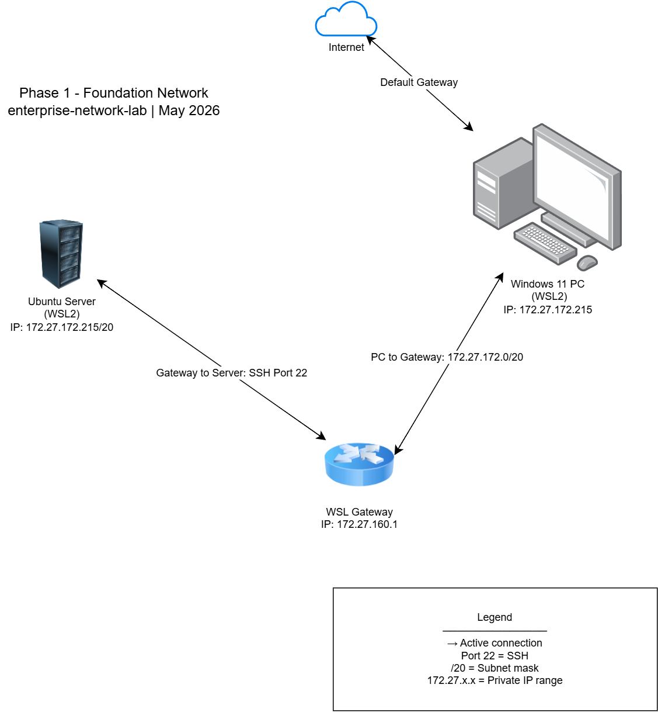

# Phase 1 — Foundation

## Overview
Built a foundational Linux environment using WSL2 on Windows 11.
Configured networking, SSH, user management, and bash scripting.
This phase covers core skills required for IT Technician and 
Junior Network Engineer roles.

## Environment
| Component | Details |
|---|---|
| Host OS | Windows 11 |
| Linux | Ubuntu 22.04 LTS (WSL2) |
| IP Address | 172.27.172.215 |
| Subnet | 172.27.172.0/20 |
| Gateway | 172.27.160.1 |
| SSH Port | 22 |

## What I Built
- Configured Ubuntu Linux from scratch
- Set up and secured SSH server
- Generated RSA 4096 bit SSH key pair
- Created user accounts and groups
- Built bash scripts to automate tasks
- Documented full network topology

## Skills Demonstrated

### Linux Administration
- System updates and package management
- File system navigation and management
- File permissions (chmod, chown)
- User and group management
- Process management (ps, top, htop, kill)
- Service management (start, stop, restart)

### Networking
- Network interface configuration
- IP addressing and subnetting
- Routing table analysis
- Port scanning with netstat
- Connectivity testing with ping
- Path tracing with traceroute
- DNS configuration (/etc/resolv.conf)
- Hosts file management (/etc/hosts)

### Security
- SSH server configuration
- RSA key pair generation
- File permission hardening
- User privilege management (sudo)
- Account locking and unlocking

### Scripting
- Bash script creation
- Executable permissions
- Automated network reporting
- Command output redirection

## Network Diagram

## Tools Used
| Tool | Purpose |
|---|---|
| Ubuntu WSL2 | Linux environment |
| OpenSSH | Remote access |
| net-tools | Network analysis |
| htop | Process monitoring |
| draw.io | Network documentation |
| Git | Version control |

## Commands Reference
| Command | What It Does |
|---|---|
| ip addr show | Show network interfaces |
| netstat -tulpn | Show open ports |
| ping -c 4 host | Test connectivity |
| traceroute host | Trace network path |
| ss -tulpn | Socket statistics |
| chmod 600 file | Secure file permissions |
| ssh-keygen -t rsa | Generate SSH keys |
| ps aux | Show all processes |
| df -h | Show disk usage |
| free -h | Show RAM usage |

## What I Learned
- How Linux stores and manages users and groups
- How SSH authentication works with key pairs
- How network interfaces and routing tables work
- How file permissions protect system security
- How to automate tasks with bash scripts
- How to document infrastructure professionally

## Next Phase
Phase 2 will add network segmentation using VLANs,
routing protocols, and pfSense firewall configuration
using Packet Tracer and VirtualBox.
